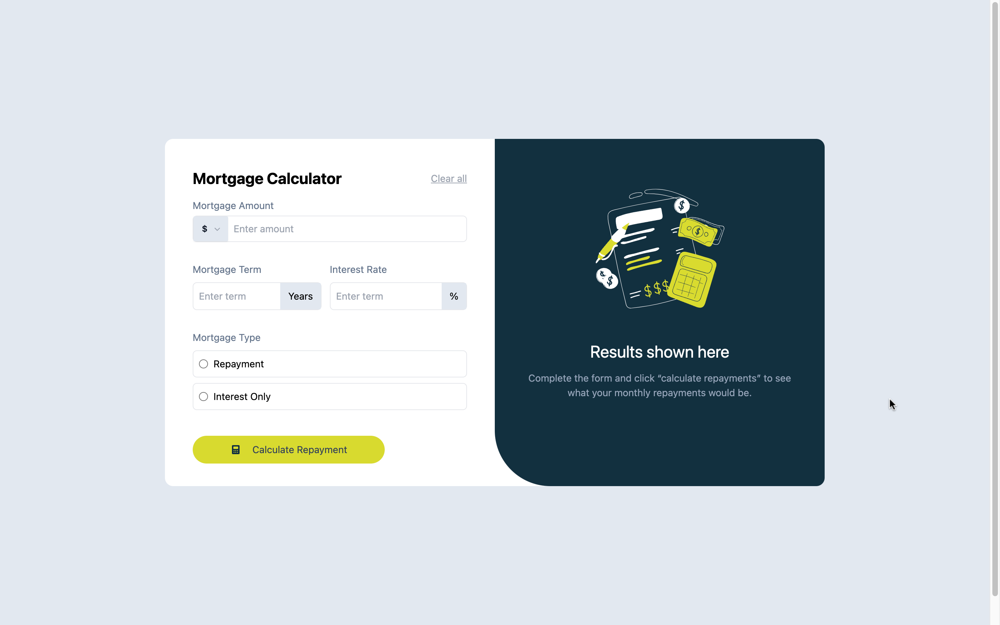

# Frontend Mentor - Mortgage repayment calculator solution

This is a solution to the [Mortgage repayment calculator challenge on Frontend Mentor](https://www.frontendmentor.io/challenges/mortgage-repayment-calculator-Galx1LXK73). Frontend Mentor challenges help you improve your coding skills by building realistic projects. 

## Table of contents

- [Overview](#overview)
  - [The challenge](#the-challenge)
  - [Screenshot](#screenshot)
  - [Links](#links)
- [My process](#my-process)
  - [Built with](#built-with)
  - [What I learned](#what-i-learned)
  - [Continued development](#continued-development)
- [Author](#author)

## Overview

### The challenge

Users should be able to:

- Input mortgage information and see monthly repayment and total repayment amounts after submitting the form
- See form validation messages if any field is incomplete
- Complete the form only using their keyboard
- View the optimal layout for the interface depending on their device's screen size
- See hover and focus states for all interactive elements on the page

### Screenshot

### Links

- Solution URL: [Add solution URL here](https://github.com/MrKB03-creator/mortgage.git)
- Live Site URL: [Add live site URL here](https://your-live-site-url.com)

## My process

### Built with

- [Vite + React](https://reactjs.org/) - JS library
- [TailwindCSS](https://tailwindcss.com/) -  CSS framework

### What I learned

In the course of this project, I gained valuable experience in integrating Vite, React, and Tailwind. This experience has deepened my understanding of the data structure underlying these frameworks.

### Continued development

I am currently focusing on my portfolio and enhancing my front-end skills through various projects.

## Author

- Frontend Mentor - [@yourusername](https://www.frontendmentor.io/profile/yourusername)
